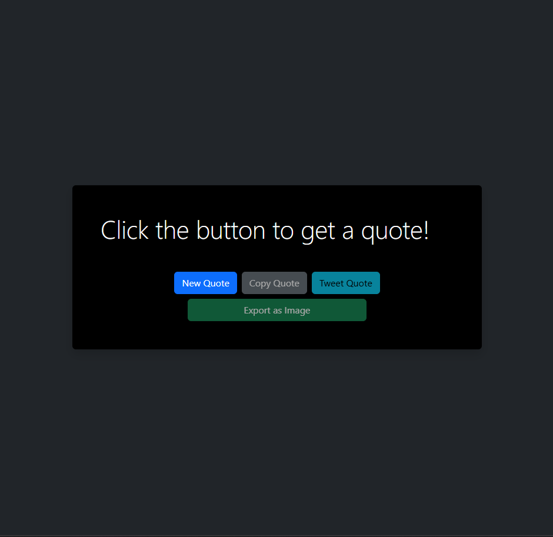
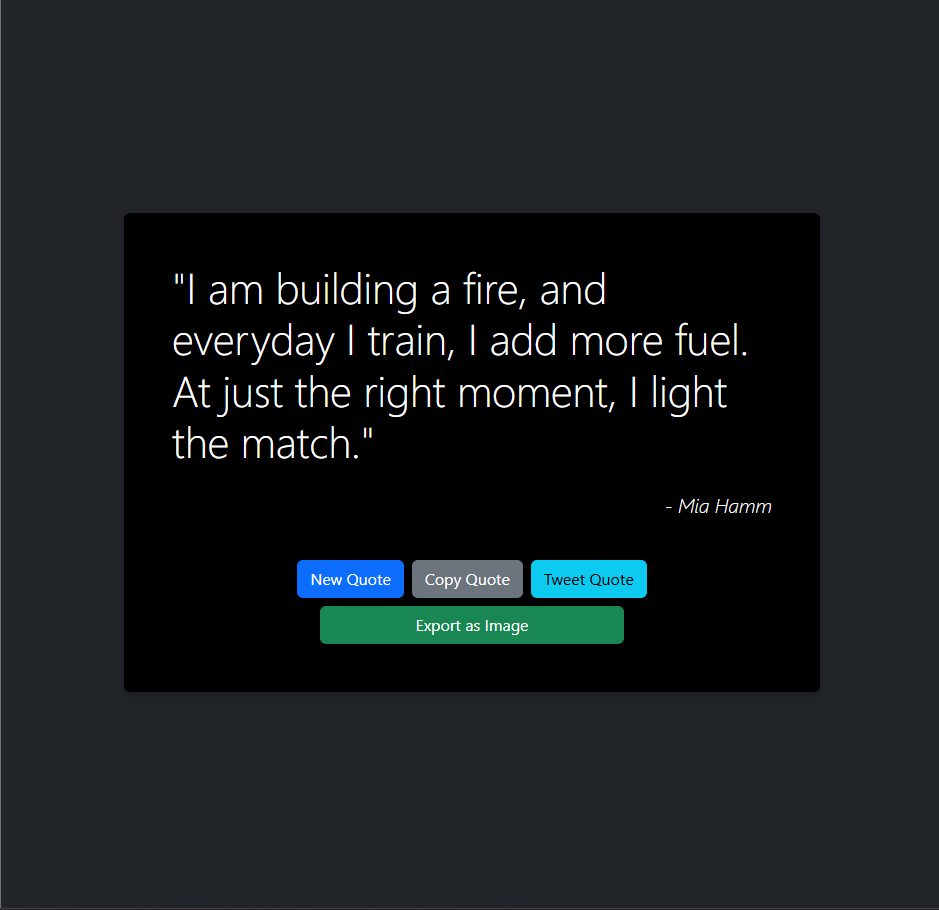
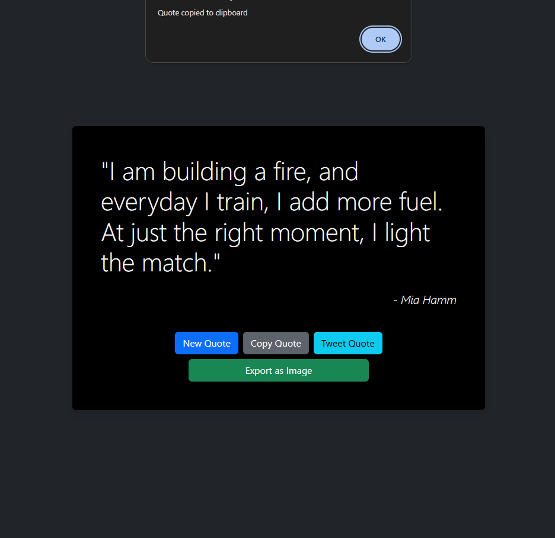
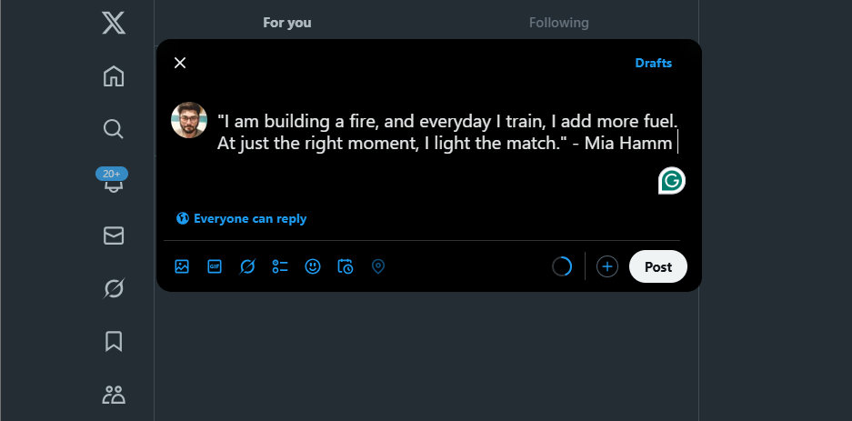

# Quote of the Day

A simple web application that fetches and displays random quotes. Users can copy quotes, tweet them, or export them as images.

## Features

- Fetch random quotes from an API.
- Copy quotes to the clipboard.
- Share quotes on Twitter.
- Export quotes as images.
- Responsive design for mobile and desktop.

## Technologies Used

- **HTML5** and **CSS3** for the structure and styling.
- **JavaScript** for interactivity.
- **Bootstrap** for responsive design.
- **html2canvas** for exporting quotes as images.
- **Vite** for development and build tooling.

## Application Features

- **New Quote**: Fetch a random quote with a single click.
- **Copy to Clipboard**: Easily copy quotes for sharing or saving.
- **Tweet Integration**: Share quotes directly on Twitter.
- **Export as Image**: Save quotes as images for offline use.

## Screenshots







## Deployment

- **Hosted URL**: [https://quote-ashy-pi.vercel.app/](https://quote-ashy-pi.vercel.app/)
- **GitHub Repository**: [https://github.com/rejisterjack/quote.git](https://github.com/rejisterjack/quote.git)

## Setup

1. Clone the repository:
   ```bash
   git clone https://github.com/rejisterjack/quote.git
   cd quote
   ```

2. Install dependencies:
   ```bash
   npm install
   ```

3. Start the development server:
   ```bash
   npm run dev
   ```

4. Open the application in your browser at `http://localhost:5173`.

## Usage

- Click the **New Quote** button to fetch a random quote.
- Use the **Copy Quote** button to copy the quote to your clipboard.
- Click the **Tweet Quote** button to share the quote on Twitter.
- Use the **Export as Image** button to save the quote as an image.

## License

This project is licensed under the MIT License. See the LICENSE file for details.
